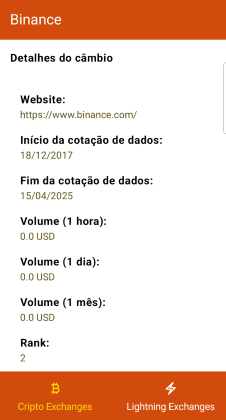

# CryptoDroid





Consuming the [coinapi.io](https://docs.coinapi.io/?shell#list-all-exchanges-get) 🪙 API and bringing the exchanges in the form of a list and detail data for the selected item. Using Jetpack Compose to build the UI with submodules in the project to hit a second [mempool.space](https://mempool.space) API to display ⚡ lightning data.
Using static analysis with spotless and detect, unit and UI tests with JUnit4 and ComposeTestRule.
Error handling with the use of Result and State, in addition to an MVI architecture, Kotlin Flow with Clean Architecture.

### Features
- **List screen for both APIs**
- **Detail screen**
- Displays the details of the selected exchange.

### Technical Requirements 🏆
| Android         |
|-----------------|
| Kotlin          |
| Compose         |
| Kotlin Flow     |
| Koin            |
| Navigation      |
| Unit Tests      |
| UI Tests        |
| Multi-modules   |
| Static analysis |

#### Architecture

- MVI (using command pattern) with 4-layer Clean where it used to load local data from a pre-loaded JSON. Other layers data, domain and presentation were implemented.

### How to run the project
1. Clone the repository:
```bash
git clone
```
2. Open the project in Android Studio.
3. Make sure Gradle is synchronized.
4. In the app and lightning modules you must add the **module.properties** file. Inside add API_URL and TOKEN_KEY from the coinapi.io API and mempool.space.
5. Run the application on an emulator or physical device.

### Motivation
The project was developed for study purposes and to demonstrate some of the knowledge acquired over several years as an Android developer. The idea is to bring a simple application, but one that uses good development, architecture and testing practices.

### Difficulties
During development, I saw the difficulty of having to deal with the coinapi.io API, where there is a request limit on the free plan. To get around this, a local reading of response json data was added.
Another challenge was the use of Roboletric in some tests where "flaky tests" appeared intermittently when running the tests via script for pre-pushing to git. As a result, they were ignored.